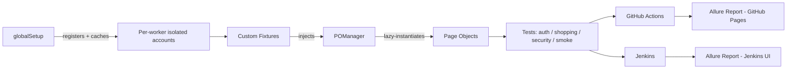

# playwright-ecommerce-automation

[](https://github.com/Abdelrhman-Kamel/playwright-ecommerce-automation/actions/workflows/playwright.yml)


**[📊 Live Allure Report](https://abdelrhman-kamel.github.io/playwright-ecommerce-automation/)** · **[⚙️ CI Workflow](https://github.com/Abdelrhman-Kamel/playwright-ecommerce-automation/actions)** · **[🛒 App Under Test](https://rahulshettyacademy.com/client/)**

An end-to-end test automation framework for an e-commerce site ([Rahul Shetty Academy's practice app](https://rahulshettyacademy.com/client/)), built to demonstrate production-grade Playwright practices: page object architecture, worker-isolated authentication, API-level security testing, visual regression, accessibility auditing, and dual CI/CD pipelines with rich reporting.

**76 tests** across UI, API, security, visual regression, and accessibility layers — **70 passing, 6 tracked known issues** (real bugs found via automation), organized by feature domain, tagged for selective execution, and running clean in both GitHub Actions and Jenkins.

---

## 🏗️ Architecture at a glance



---

## ✨ Highlights

- **Page Object Model** with a lazy-caching `POManager` and worker-isolated authentication
- **API-level security testing** and network-level API mocking
- **Visual regression + WCAG 2.1 AA accessibility testing**, scoped thoughtfully to where each is actually trustworthy
- **Dual CI/CD** (GitHub Actions + Jenkins) with Allure reporting on both
- **Real bugs found and documented** via automation, not hidden — see [Known Issues](docs/known-issues.md)

Full breakdown of what this project demonstrates, and why each architectural choice was made: **[📁 docs/](docs/)**

---

## 🚀 Quick start

```bash
git clone https://github.com/Abdelrhman-Kamel/playwright-ecommerce-automation.git
cd playwright-ecommerce-automation
npm install
cp .env.example .env   # fill in real values — see docs/reference/env-variables.md
npm run test:chromium
```

Full setup, environment variables, and script reference: **[🚀 Getting Started](docs/getting-started.md)**

---

## 🔁 CI/CD

**GitHub Actions** — triggers on every push/PR to `main` or `master`, plus manual dispatch. Runs the Chromium `@regression` suite, then deploys a live Allure report to GitHub Pages.

**Jenkins** — a Declarative Pipeline mirroring the same scope, with native in-Jenkins Allure rendering, job-level timeout, and concurrent-build protection.

Details on both, plus the Allure setup behind them: **[🔁 Allure Reporting](docs/reference/allure-reporting.md)**

---

## 📁 Project structure

```
playwright-ecommerce-automation/
├── .github/workflows/       # GitHub Actions CI
├── Jenkinsfile               # Jenkins pipeline
├── docs/                     # full documentation — see docs/README.md
├── constants/routes.js
├── fixtures/pageFixtures.js
├── pageObjects/               # one class per page/component
├── setup/globalSetup.js
├── tests/                     # auth / shopping / security / smoke
├── utils/
├── eslint.config.js           # ESLint + playwright plugin
├── eslint-suppressions.json   # baseline for pre-existing lint issues
├── .prettierrc                # code style config
├── package.json                # scripts, dependencies
├── playwright.config.js
└── .env.example
```

---

## 📚 Documentation

This README is deliberately a slim entry point. Everything else — architecture decisions, guides, reference material, the full known-issues writeup — lives in **[`docs/`](docs/)**, organized by [Diátaxis](https://diataxis.fr/) (tutorials, how-to guides, reference, explanation) rather than one long file trying to be all four at once.

- **[Getting Started](docs/getting-started.md)**
- **[Architecture Overview](docs/architecture/overview.md)** + **[Decisions](docs/architecture/decisions/)**
- **[Guides](docs/guides/)** — writing a test, adding a page object, debugging flaky tests
- **[Reference](docs/reference/)** — env variables, npm scripts, tagging strategy, Allure reporting
- **[Known Issues](docs/known-issues.md)**
