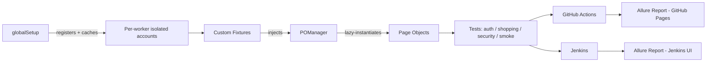

# playwright-ecommerce-automation

[](https://github.com/Abdelrhman-Kamel/playwright-ecommerce-automation/actions/workflows/playwright.yml)


**[📊 Live Allure Report](https://abdelrhman-kamel.github.io/playwright-ecommerce-automation/)** · **[⚙️ CI Workflow](https://github.com/Abdelrhman-Kamel/playwright-ecommerce-automation/actions)** · **[🛒 App Under Test](https://rahulshettyacademy.com/client/)**

An end-to-end test automation framework for an e-commerce site ([Rahul Shetty Academy's practice app](https://rahulshettyacademy.com/client/)), built to demonstrate production-grade Playwright practices: page object architecture, worker-isolated authentication, API-level security testing, and dual CI/CD pipelines with rich reporting.

**76 tests** across UI, API, security, visual regression, and accessibility layers — **70 passing, 6 tracked known issues** (real bugs found via automation, see [below](#known-issues-found-via-automation)) — organized by feature domain, tagged for selective execution, and running clean in both GitHub Actions and Jenkins.

---

## Architecture at a glance



---

## What this project demonstrates

- **Page Object Model** with a lazy-caching `POManager` — every page object is instantiated once per test and reused, not recreated per call
- **Worker-isolated authentication** — each Playwright worker registers and logs into its own account via `globalSetup`, eliminating cross-test race conditions on shared cart/order state. Accounts are cached across runs (with staleness detection) so repeat local runs don't pay full registration cost every time
- **Resilience against real external flakiness** — a retry wrapper (`registerWithRetry`) tolerates the practice site's known-flaky registration endpoint without masking genuine failures, generating fresh credentials on each retry rather than resubmitting a possibly-already-created account
- **API-level security testing** — a dedicated suite (`tests/security/`) that logs in via raw API calls (not the UI) to test authorization boundaries, including a cross-account access test that creates a fresh order on a separate, pre-configured account on the fly, rather than depending on a hardcoded, externally-owned order ID
- **Network-level API mocking** — a test that simulates an empty-orders state by intercepting and replacing the real API response, without needing to manually clear real data first
- **Real bugs found and documented** via automation — 2 functional defects and a full WCAG 2.1 AA accessibility audit finding, see [Known Issues](#known-issues-found-via-automation) below
- **Visual regression testing** on dashboard, cart, and checkout — using masking and a small pixel-diff tolerance to handle known dynamic content (an animating promo banner, per-run randomized account data) without losing real regression coverage. Deliberately _not_ run on the login page — its hero section rotates through multiple unrelated background/content variants on load, making full-page pixel comparison structurally unreliable there rather than just occasionally flaky
- **Accessibility testing** — `@axe-core/playwright` WCAG 2.1 AA scans across all 4 key pages (login, dashboard, cart, checkout)
- **Dual CI/CD**: GitHub Actions (chromium-only regression pass on every push, deploying a live Allure report to GitHub Pages) and Jenkins (matching pipeline, native in-Jenkins Allure reporting, polling-based triggers)
- **Allure reporting** with automatic environment metadata, executor tracking, and epic/feature tagging derived from test tags

---

## Tech stack

| Layer                 | Tool                                                                                       |
| --------------------- | ------------------------------------------------------------------------------------------ |
| Test runner           | [Playwright](https://playwright.dev/) (`@playwright/test`)                                 |
| Language              | JavaScript (ES modules)                                                                    |
| Test data             | [`@faker-js/faker`](https://fakerjs.dev/)                                                  |
| Accessibility testing | [`@axe-core/playwright`](https://www.npmjs.com/package/@axe-core/playwright) (WCAG 2.1 AA) |
| Visual regression     | Playwright native (`toHaveScreenshot()`)                                                   |
| Reporting             | [Allure](https://allurereport.org/) (`allure-playwright` + `allure-commandline`)           |
| CI/CD                 | GitHub Actions, Jenkins (Declarative Pipeline)                                             |
| Env config            | `dotenv`                                                                                   |

---

## Project structure

```
playwright-ecommerce-automation/
├── .github/workflows/
│   └── playwright.yml        # CI: chromium-only regression + Allure → GitHub Pages
├── Jenkinsfile                # Matching pipeline: chromium-only regression + native Allure reporting
├── constants/
│   └── routes.js              # Centralized route paths (single source of truth)
├── fixtures/
│   └── pageFixtures.js        # Custom Playwright fixtures — page objects, per-worker auth
├── pageObjects/                # One class per page/component
│   ├── POManager.js           # Lazy-caching factory for all page objects
│   ├── LoginPage.js
│   ├── RegisterationPage.js
│   ├── HomePage.js
│   ├── CartPage.js
│   ├── CheckoutPage.js
│   ├── OrderDetailsPage.js    # Post-checkout confirmation page
│   ├── OrderViewPage.js       # Orders → View detail page (different template)
│   ├── OrdersPage.js
│   └── SideBar.js
├── setup/
│   └── globalSetup.js         # Per-worker account registration, caching, cleanup
├── tests/
│   ├── auth/                  # Login, registration
│   ├── shopping/              # Dashboard, cart, checkout, orders
│   ├── security/              # API-level authorization tests
│   └── smoke/                 # Full end-to-end purchase journey
├── utils/
│   ├── testData.js            # Faker-based data generation
│   ├── registerWithRetry.js   # Shared retry wrapper for the flaky registration endpoint
│   └── API_Utils.js           # Raw API client for security tests
├── playwright.config.js
├── package.json
└── .env.example                # Documents every required environment variable
```

---

## Getting started

### Prerequisites

- Node.js (LTS)
- Java (required by Allure's report generator)

### Setup

```bash
git clone https://github.com/Abdelrhman-Kamel/playwright-ecommerce-automation.git
cd playwright-ecommerce-automation
npm install
```

Copy `.env.example` to `.env` and fill in real values:

```bash
cp .env.example .env
```

| Variable                                                 | Purpose                                                                                                                                                                           |
| -------------------------------------------------------- | --------------------------------------------------------------------------------------------------------------------------------------------------------------------------------- |
| `BASE_URL`                                               | Base URL of the app under test                                                                                                                                                    |
| `LOGIN_USERNAME` / `LOGIN_PASSWORD`                      | Stable, pre-existing account used only by `login.spec.js` (that flow needs an account that already exists, unlike the fresh accounts `globalSetup` registers for everything else) |
| `SECURITY_TEST_EMAIL` / `SECURITY_TEST_PASSWORD`         | Primary account for the security test suite's API calls                                                                                                                           |
| `SECONDARY_ACCOUNT_EMAIL` / `SECONDARY_ACCOUNT_PASSWORD` | A second, distinct account used to test cross-account authorization boundaries                                                                                                    |

### Running tests

```bash
npm test                    # full suite, all 3 browsers
npm run test:chromium       # chromium only (fastest local feedback loop)
npm run test:smoke          # just the smoke suite
npm run test:regression     # the full tagged regression suite
npm run test:security       # just the security suite
npm run test:ui             # Playwright's interactive UI mode
npm run test:headed         # headed browser, useful for debugging
```

### Viewing reports

```bash
npm run test:report         # Playwright's built-in HTML report
npm run allure:generate     # build the Allure report from the last run
npm run allure:open         # open it in your browser
```

---

## CI/CD

**GitHub Actions** — triggers on every push/PR to `main` or `master`. Runs the chromium-only `@regression` suite, then generates and deploys an Allure report to GitHub Pages:

📊 **[Live report](https://abdelrhman-kamel.github.io/playwright-ecommerce-automation/)**

**Jenkins** — a Declarative Pipeline (`Jenkinsfile`) mirroring the same test scope, with native Allure report rendering inside Jenkins' own UI, plus job-level timeout, concurrent-build protection, and build/artifact retention limits. The job polls GitHub for changes on a schedule (configured in the Jenkins job itself, not the `Jenkinsfile` — a local Jenkins instance can't receive GitHub webhooks without a public endpoint, so polling is the practical alternative).

Both pipelines set `CI=true` explicitly so `playwright.config.js`'s environment-aware settings (retry count, `forbidOnly`) behave consistently regardless of which CI system is running.

<!--
  TODO: Replace with a real screenshot of the Allure dashboard.
  1. Take a screenshot of https://abdelrhman-kamel.github.io/playwright-ecommerce-automation/
  2. Save it to a new `docs/` folder as `allure-overview.png`
  3. Uncomment the line below
-->
<!--  -->

---

## Known issues (found via automation)

Real application defects discovered while building this suite — not pre-known bugs, but issues the automation itself caught. All are documented in code via Playwright's `test.fail()` annotation: the tests still run every time, a failure is the _expected_, tracked outcome, and the suite would immediately flag it if any of these were ever silently fixed.

**Functional bugs**

1. **Login is case-sensitive on email** — most platforms treat email as case-insensitive for login; this one requires an exact case match against how the account was originally registered.
2. **Product search doesn't match case-insensitively** — searching a lowercase term returns zero results even when a matching product exists with different casing.

**Accessibility audit (WCAG 2.1 AA)** — added `@axe-core/playwright` scans across the login, dashboard, cart, and checkout pages. Every page failed, split across two categories:

| Category                                                                    | Impact                                                                    | Found on    | Example                                                                                                                                                                                                   |
| --------------------------------------------------------------------------- | ------------------------------------------------------------------------- | ----------- | --------------------------------------------------------------------------------------------------------------------------------------------------------------------------------------------------------- |
| Missing accessible names (`label`, `select-name`, `image-alt`, `link-name`) | **Critical/Serious** — screen readers announce nothing for these elements | All 4 pages | Checkout's credit card, name, and coupon inputs have no `<label>`; product images have no `alt` text; social media icons have no accessible text                                                          |
| Insufficient color contrast (`color-contrast`)                              | **Serious**                                                               | All 4 pages | The site-wide "Get Shortlisted by Recruiters" banner — confirmed manually, and additionally animates/blinks without a way to pause it (a separate WCAG 2.2.2 concern automated scans don't fully capture) |

The missing-accessible-names findings are the more severe of the two — a screen reader user filling out the checkout form would hear "edit text" with no indication of which field is which.

---

## Design notes worth highlighting

- **`OrderDetailsPage` vs `OrderViewPage`** — the immediate post-checkout confirmation page and the "Orders → View" detail page turned out to be two genuinely different templates (confirmed by inspecting real DOM, not assumed), so they're modeled as two separate page objects rather than one page object incorrectly trying to represent both.
- **Deterministic waits over `networkidle`** — `waitForLoadState("networkidle")` proved unreliable on this site (a persistent third-party banner script keeps network activity going indefinitely). Replaced throughout with waits tied to specific outcomes — element visibility, URL changes, or count changes — matching what each action actually needs to confirm.
- **Fresh accounts per worker, not a shared login** — avoids the cross-test data races that come from multiple parallel workers acting on one shared cart/order history.
- **Visual regression scoped to pages where it's actually meaningful** — rather than forcing full-page screenshot comparison everywhere, the login page was deliberately excluded once its hero section proved to rotate through multiple unrelated background/content variants on load. Masking and pixel tolerance solve _localized_ instability (an animating banner, variable-length account data); they don't solve "half the page is randomly different content," so the honest choice was to not run that comparison there rather than weaken it into a test that no longer verifies anything meaningful.
