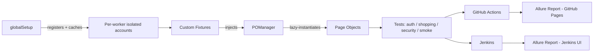

# Architecture Overview

## The layers

## Why it's shaped this way

**`globalSetup` runs before any test, once per worker.** It registers a fresh account for that worker and caches it (24h staleness window) so repeat local runs don't pay full registration cost every time. See [ADR 0001](decisions/0001-per-worker-account-isolation.md) for why per-worker isolation exists at all instead of one shared login.

**Custom fixtures (`fixtures/pageFixtures.js`) inject page objects into every test** — a test asks for `loginPage` or `checkoutPage` as a parameter, and Playwright's fixture system resolves it, backed by `POManager`.

**`POManager` lazily instantiates and caches page objects per test.** Nothing gets constructed until a test actually asks for it, and asking twice returns the same instance rather than a fresh one.

**Page objects are one class per page or reusable component**, wrapping locators and actions. Locators favor semantic selectors (`getByRole`, `getByText`) over CSS/XPath wherever the underlying app's markup allows it.

**Tests are organized by domain** (`auth/`, `shopping/`, `security/`, `smoke/`), not by test type — a checkout test lives with other checkout tests, not in a separate "e2e" bucket.

**Both CI platforms run the same test command** and feed results into Allure, just with different report-hosting mechanisms (GitHub Pages vs. native Jenkins plugin rendering) — see [Allure reporting reference](../reference/allure-reporting.md).

## Where to look for a specific decision

Non-obvious choices with real trade-off reasoning live in [Architecture Decision Records](decisions/) — one file per decision, not buried in a code comment you'd only find by accident.
